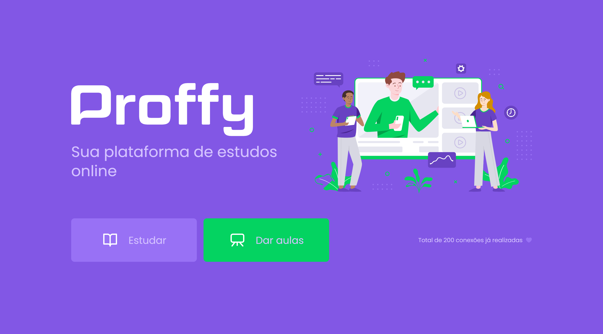

<h1 align="center">
    
</h1>
<div align="center">
  <a href="https://github.com/magdielndantas/rocketseat-nlw2-proffy/blob/master/LICENSE">
    
  </a> 
  <a href="https://github.com/magdielndantas/rocketseat-nlw2-proffy/commits/master">
    
  </a>
</div>

## Descrição

Projeto desenvolvido na trilha Omnistack da Next Level Week 2 promovida pela Rocketseat entre os dias 3 e 7 de agosto de 2020. Esse projeto teve como intuito desenvolver minhas habilidades relacionadas a front-end e back-end e se trata de uma aplicação para professores e alunos se conectarem.
<br/>
<br/>

<div align="center">
  
</div>
<br/>
<br/>

Layouts: [clique aqui](https://www.notion.so/Layout-Proffy-3d5f45f54ec54ef9b2103565b7cce4e1)

## Tecnologias

As tecnologias usadas para desenvolver este projeto foram:

### API

- [Express](https://expressjs.com/en/api.html#express)
- [Knex](http://knexjs.org/)
- [Node](https://nodejs.org/en/)
- [SQLite 3](https://www.npmjs.com/package/sqlite3)
- [Typescript](https://www.typescriptlang.org/)
- [Ts-node-dev](https://github.com/whitecolor/ts-node-dev)

### Mobile

- [AsyncStorage](https://docs.expo.io/versions/latest/sdk/async-storage/)
- [Axios](https://github.com/axios/axios)
- [React Native](https://reactnative.dev/)
- [React Navigation](https://reactnavigation.org/)
- [Expo](https://expo.io/)
- [Typescript](https://www.typescriptlang.org/)

### Web

- [Axios](https://github.com/axios/axios)
- [CSS](https://www.w3schools.com/css/)
- [React](https://reactjs.org/)
- [React Router](https://github.com/ReactTraining/react-router)
- [Typescript](https://www.typescriptlang.org/)

## Aprendizado

### Primeiro dia: Acelerando sua evolução

No primeiro dia foi explanado coisas sobre o método utilizado pela Rocketseat em seus cursos (Foco, pratica, grupo). Vimos o um pouco do impacto desse método na vida de alunos dos cursos.

Tivemos o primeiro contato com o ReactJS, componentes, como funciona o Typescript dentro do projeto, pra que servem os arquivos criados a partir do "create-react-app" e começamos a cordar as primeiras partes do Proffy. Demos também inicio a páginação da aplicação com o react-router-dom.

- Estruturar e estilizar da landing page ✔
- Configurar navegação ✔
- Estruturar e estilizar da listagem de professores ✔
- Criar componentes comuns ✔

### Segundo dia: Olhando as opotunidades

No segundo dia foi esclarido a importancia de escolher uma stack e ficar de olho nas oportunidades, se mantendo sempre preparado, e ter uma boa network e se manter visível nas redes ser um diferencial enorme quando os recrutadores estiverem buscando por profissionais.

Criamos uma API REST com Node com Express, utilizando Knex para fazer migrations.

- Identificar casos de uso ✔
- Configurar conexão com o banco ✔
- Criar tabelas no banco de dados ✔
- Cadrastro de aulas ✔
- Listagem de aulas ✔
- Criar número total de conexões ✔

### Terceiro dia: A escolha da stack

Foi abordado a importancia de levar em consideração o momento, contexto e objetivo ao escolher uma stack para se trabalhar. Que tipo de profissional está sendo buscado? Qual é o tamanho da comunidade? Que tipos de problemas ela resolve? e outras perguntas são interessantes de se fazer ao escolher as técnologias que tomarão seu tempo de estudo e dedicação.

- Estruturar e estilizar página de cadastro ✔
- Novos componentes comuns ✔
- Integração com API
  - Preparando cadastro de horários ✔
  - Carregando total de conexões ✔
  - Cadastro de novas aulas ✔
  - Listagem de professores ✔

### Quarto dia: Até 2 anos em 2 meses

Manter o foco e não pular etapas são coisas essênciais para o crescemento de um profissional. Querer conhecer novas tecnologias é bom, mas não pode ser prioridade se você quer conhecer só por conhecer. Praticar é a chave mestra que serve para criar uma distancia entre você e quem não faz nada além de copiar código. Ter um grupo/ comunidade disposta a ver seu crescimento e sanar suas duvidas é uma ferramenta incrível e que muito ajuda no senso de equipe. Foco, pratica e grupo são os pilares de um bom desenvolvedor.

Quarto dia foi o dia em que demos inicio a criação do aplicativo mobile com react native utilizando Expo.

- Iniciar projeto utilizando Expo ✔
- Estruturando e estilizar tela de entrada ✔
- Navegação da tela inicial ✔
- Página "Dar aulas" ✔
- Páginas internas ✔
- Navegação stack/ tabs ✔
- Criação de componente comum ✔

### Ultimo dia: A milha extra

Ir além do comum é o maior desafio para quem quer se destacar. Por isso a milha extra é um fator importante para qualquer dev que deseja crescer e sempre se manter a frente de outros profissionais.

Esse último dia foi inteiramente para fazer a integração da API com a aplicação mobile, além de finalizar alguns detalhes no layout.

- Listagem de professores ✔
- Filtro ✔
- Integração com a API ✔
  - Carregando total de conexões ✔
  - Listando professores ✔
- Contato via Whatsapp ✔
- Adicionar e remover Proffys favoritos ✔
- Listagem favoritos ✔

## Desafios da milha extra

Notion com a lista completa ([click aqui](https://www.notion.so/Vers-o-2-0-Proffy-eefca1b981694cd0a895613bc6235970))

## Como usar

```
# Para clonar esse repositório
$ git clone https://github.com/magdielndantas/rocketseat-nlw2-proffy
```

### Servidor

Para clonar e dar start nesta aplicação voce deverar ter instalado o Git, Node.js + Yarn v1. No seu terminal de comando digite:

```
Para rodar o servidor:

# Entre na pasta web
$ cd server

# Instale as dependencias
$ yarn

# Rode a aplicação
$ yarn start
```

Agora acesse no navegador: http://localhost:3333

### Web

Para clonar e dar start nesta aplicação voce deverar ter instalado o Git, Node.js + Yarn v1. No seu terminal de comando digite:

```
Para rodar o front-end web:

# Entre na pasta web
$ cd web

# Instale as dependencias
$ yarn

# Rode a aplicação
$ yarn start
```

Agora acesse no navegador: http://localhost:3000

### Mobile

Para clonar e dar start nesta aplicação voce deverar ter instalado o Git, Node.js + Yarn v1. No seu terminal de comando digite:

```
Para rodar a apricação mobile:

# Entre na pasta mobile
$ cd mobile

# Instale as dependencias
$ yarn

# Rode a aplicação
$ yarn start
ou
$ expo start
```

Agora basta ler o QRCode com o aplicativo Expo no celular ou usar um emulador

## Agradecimentos


Agradeço a toda equipe da Rocketseat, especialmente aos instrutores Diego Fernandes e Mayk Brito, por se dedicarem a construir e destribuir tanto conhecimento de forma gratuita. Não agredeço apenas a eles, mas a toda comunidade que fez parte dessa semana tão repleta de conteúdo, creio que parte do que fiz não seria possível sem ajuda todos.
<br/>
<br/>
<br/>
<br/>
<br/>

## 📝 Créditos, links e etc

Todo o projeto foi codado por [Magdiel Dantas](https://www.linkedin.com/in/magdielndantas/) sob instrução de Diego Fernandes

[Discord](https://discordapp.com/invite/gCRAFhc) Oficial da Rocketseat

Meu perfil no [LinkedIn](https://www.linkedin.com/in/magdielndantas/) e [Instagram](https://www.instagram.com/magdielndantas/)
